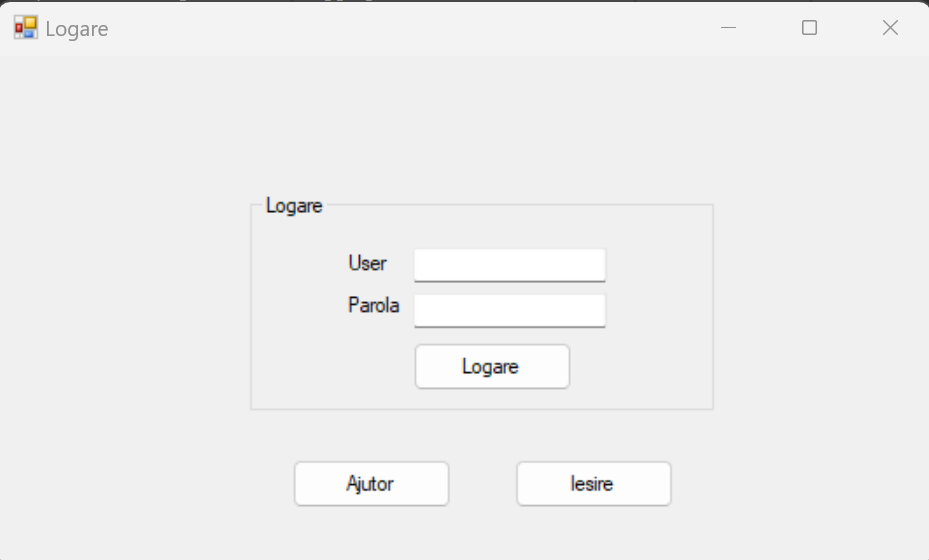
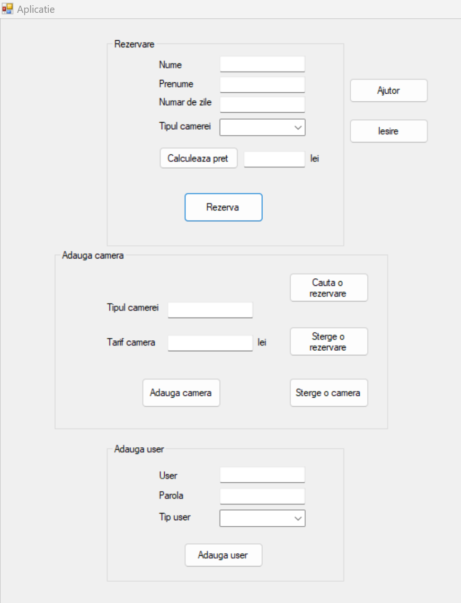
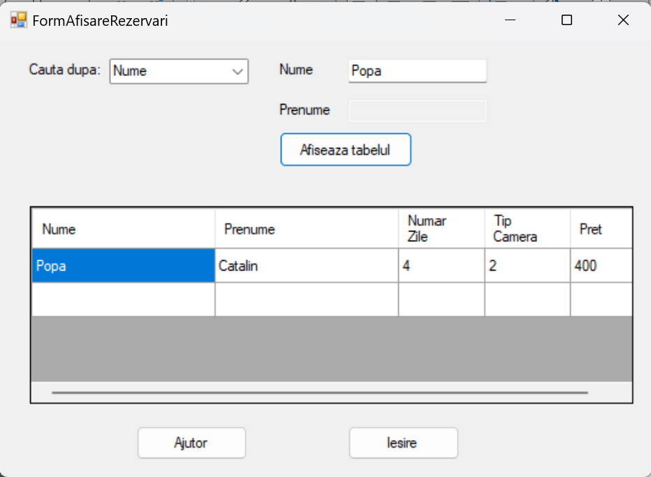
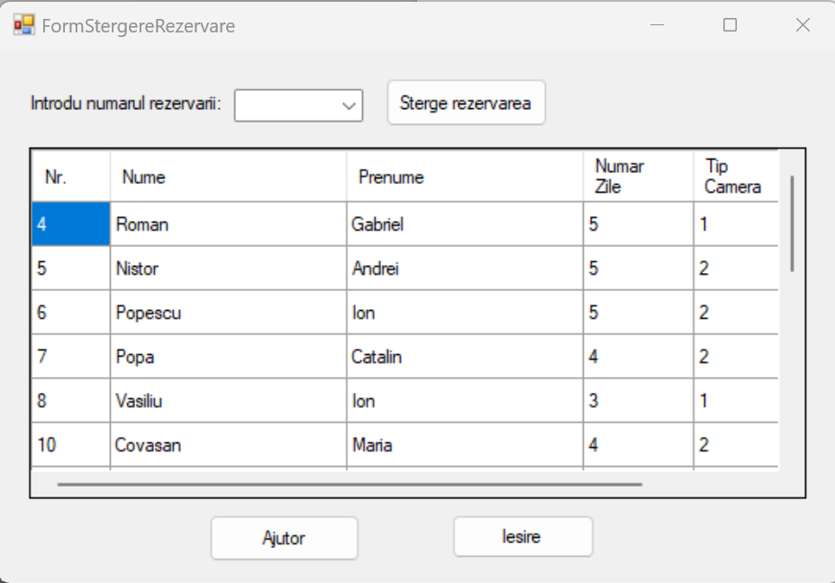
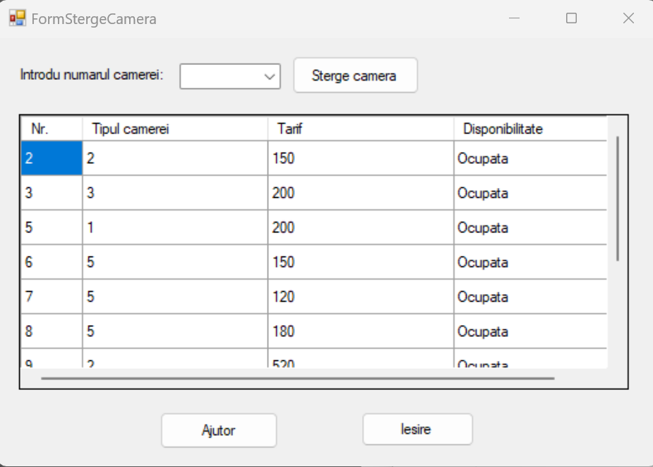
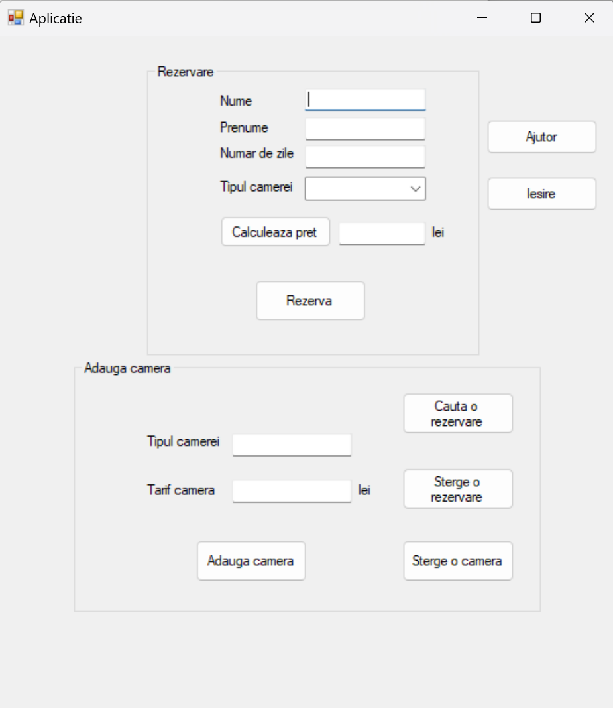
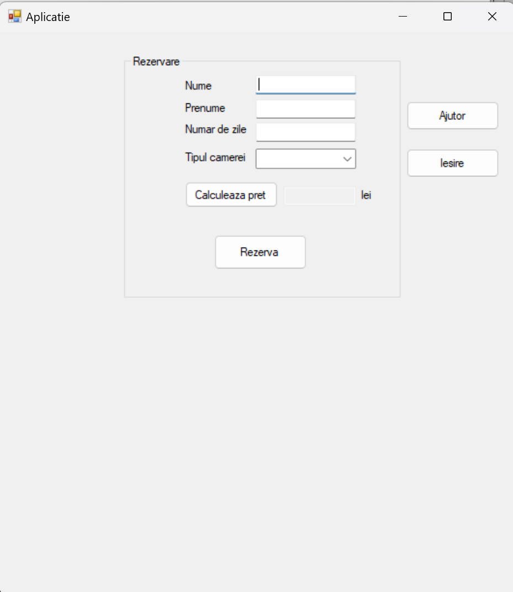
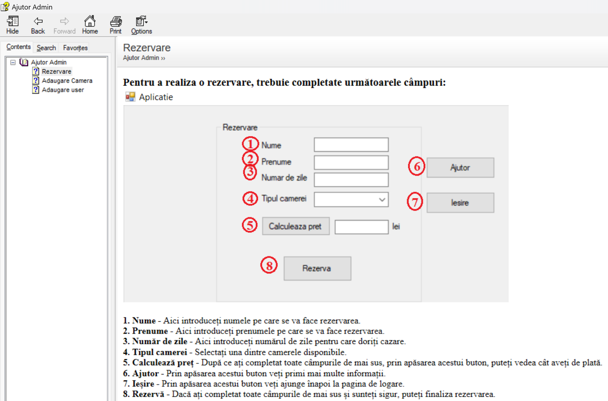

# Hotel-Management-System

Aplicația este dezvoltată în C# (.NET Framework 4.8) și utilizează SQLite pentru baza de date. Sistemul oferă o serie de funcționalități pentru a sprijini personalul hotelier în gestionarea rezervărilor și a sarcinilor administrative prin controlul accesului bazat pe roluri (administrator, recepționer sau client).

## Funcționalități

1. Funcțiile recepționerilor
- Rezervări pentru clienți
- Adăugare de camere în sistem
- Ștergerea camerelor din sistem
- Vizualizarea rezervărilor

2. Funcțiile administratorului de sistem (manager)
- Rezervări pentru clienți
- Adăugare de camere în sistem
- Ștergerea camerelor din sistem
- Vizualizarea rezervărilor
- Crearea de conturi pentru recepționeri sau clienți

3. Funcțiile clientului
- Rezervări (în cazul în care au cont)

## Interfața cu utilizatorul

### Pagina de Autentificare

### Pagina Administratorului
Administratorul este utilizatorul cu cele mai multe drepturi de acces. Pagina sa conține 3 secțiuni: Rezervare, Adaugă Cameră și Adaugă user.

### Caută o rezervare
O rezervare se poate căuta după nume, prenume sau numele și prenumele asociat rezervării.

### Șterge o rezervare
Pentru a șterge o rezervare se selectează numărul rezervării.

### Șterge o cameră
Pentru a șterge o cameră se selectează numărul camerei.

### Pagina Recepționerului
Pagina recepționerului conține 2 secțiuni: Rezervare și Adaugă Cameră. Acesta nu poate introduce utilizatori în sistem.

### Pagina Clientului
Pagina clientului conține o singură secțiune: Rezervare.

## Meniul de Help
Aplicația conține și meniuri de help create cu HelpNDoc 9.

